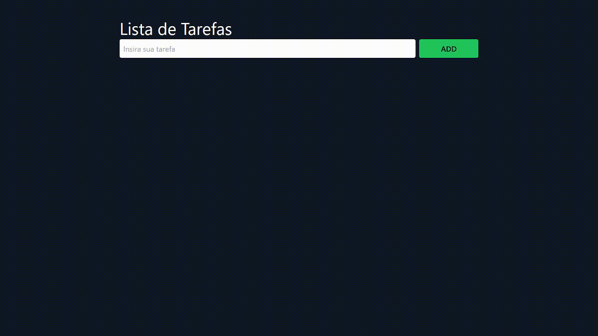

<h1 align="center" style="font-weight: bold;">Things List - Frontend 📋</h1>

 <a href="#technologies">Tecnologias</a> • 
 <a href="#description">Descrição</a> • 
 <a href="#installation">Instalação</a> •
 <a href="#collaborators">Colaboradores</a> •
 <a href="#contribute">Contribua</a>

<h2 id="technologies">💻 Tecnologias</h2>

 

<h2 id="description">📚 Descrição</h2>

O Things List é uma interface web desenvolvida com um layout simples e responsivo, focada na experiência do usuário. Este aplicativo permite gerenciar tarefas de forma prática e intuitiva. Através dele, você pode criar, visualizar, editar e excluir tarefas, tornando o controle diário mais eficiente.

<h2 id="installation">⚙️ Instalação</h2>

1. Clone esse repositório: `git clone https://github.com/victorozoterio/things-list-frontend.git`
2. Crie um arquivo `.env` a partir do arquivo `.env.example`
3. Preencha todas as variáveis ​​necessárias no arquivo `.env`
4. Instale as dependências, executando o comando: `npm install`
5. Execute a aplicação, executando o comando: `npm run dev`

<h2 id="collaborators">🤝 Colaboradores</h2>

<table>
  <tr>
    <td align="center">
      <a href="https://github.com/victorozoterio">
         
        
          <a href="https://github.com/victorozoterio">
          Victor Ozoterio</a>
        
      </a>
    </td>
  </tr>
</table>

<h2 id="contribute">📫 Contribua</h2>

1. Clone esse **repositório**: `git clone https://github.com/victorozoterio/things-list-frontend.git`
2. Criar uma **branch** para suas alterações (`git checkout -b feat/nome-aqui`)
3. Fazer um **commit** (`git commit -m 'feat: descrição'`)
4. Abra um **pull request** explicando o recurso criado, se houver, anexe uma captura de tela das modificações visuais e aguarde a revisão!

<h3>Documentações que podem ajudar</h3>

[📝 Como criar um pull request](https://www.atlassian.com/br/git/tutorials/making-a-pull-request) 
[💾 Padrões de commits](https://github.com/iuricode/padroes-de-commits)